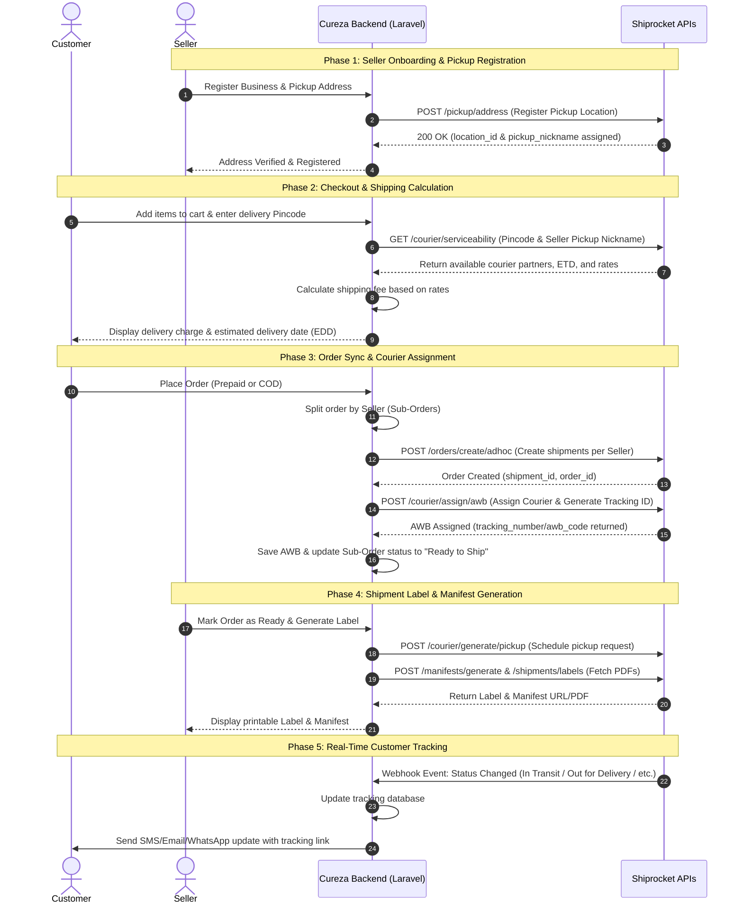

# Shiprocket API Integration Specification & Setup Guide
**Document Version:** 1.1.0  
**Target Recipient:** Shiprocket API Integrations & Support Team / Cureza Developers  
**Project:** Cureza Multi-Vendor E-Commerce Marketplace  

---

## 1. Executive Summary

**Cureza** is an advanced multi-vendor health, wellness, and e-commerce marketplace. The platform connects multiple independent vendors (Sellers) with customers across India. 

To automate our logistics and post-purchase customer experience, we intend to integrate the **Shiprocket API Suite**. Because Cureza is a marketplace, orders are fulfilled from multiple locations (each vendor's warehouse/shop). Thus, we require access to Shiprocket's **Multi-Vendor / Multi-Pickup Location APIs** to handle individual seller pickup points, calculate real-time courier serviceability, retrieve tracking codes (AWBs), and push automatic status updates to our customers.

---

## 2. Initial Setup & API User Registration

To start using the Shiprocket APIs, we must register a dedicated API user in our Shiprocket Seller Panel. Follow these official steps to generate the necessary API credentials:

1. **Log in** to the main Shiprocket Seller Panel.
2. Navigate to the left-hand menu and select:  
   **Settings ➔ API ➔ Add New API User**
3. Click on the **"Create API User"** button.
4. Fill in the pop-up form with the following criteria:
   * **Unique Email Address:** Enter a separate, active email address that is different from the main Shiprocket account login email.
   * **Modules to Access:** Select the specific API modules required for order creation, rate calculation, and tracking.
   * **Buyer's Details Access:** Set this to **Allowed** to let the API pass customer addresses and contact numbers to the courier partners.
5. Click **"Create User."**
6. **Password Delivery:** The API User password will be sent automatically to the **main registered email address** of the Shiprocket account (not the API user's secondary email address).

*These credentials (API Email and API Password) will be used to request JWT authorization tokens programmatically.*

---

## 3. Core System Workflow

The diagram below outlines the logistical workflow between the Cureza Marketplace, individual Sellers, Customers, and Shiprocket:

---

## 4. Required API Endpoints

We require access to the following Shiprocket API endpoints for our integration:

### 4.1. Authentication
* **Endpoint:** `POST /v1/external/auth/login`
* **Purpose:** To obtain the Bearer JWT token for authenticating all subsequent API requests.
* **Frequency:** Cached locally and refreshed every 24 hours.

### 4.2. Seller Pickup Locations (Multi-Pickup Points)
* **Endpoint:** `POST /v1/external/pickup/address`
* **Purpose:** To register new seller addresses as pickup locations in our Shiprocket account so couriers know where to collect the packages.
* **Payload Fields:**
  * `pickup_location` (Unique Nickname/ID of the Seller)
  * `name` (Seller Contact Person)
  * `email` (Seller Email)
  * `phone` (Seller Phone)
  * `address`, `address_2`, `city`, `state`, `country`, `pin_code`

### 4.3. Courier Serviceability & Rate Calculator
* **Endpoint:** `GET /v1/external/courier/serviceability`
* **Purpose:** During checkout, verify if delivery is possible from the Seller's pincode to the Customer's pincode, and retrieve estimated rates and delivery times.
* **Parameters:**
  * `pickup_postcode` (Seller pincode)
  * `delivery_postcode` (Customer pincode)
  * `weight` (Package weight in Kg)
  * `cod` (0 for Prepaid, 1 for COD)

### 4.4. Order Creation (Adhoc Orders)
* **Endpoint:** `POST /v1/external/orders/create/adhoc`
* **Purpose:** Once an order is placed on Cureza, sync the shipment details with Shiprocket, assigning the specific seller's pickup location nickname.
* **Payload Fields:**
  * `order_id` (Cureza sub-order ID)
  * `order_date` (Date of order)
  * `pickup_location` (Seller pickup point nickname)
  * `billing_customer_name`, `billing_last_name`, `billing_address`, `billing_city`, `billing_pincode`, `billing_state`, `billing_country`, `billing_phone`
  * `shipping_is_billing` (Boolean)
  * `order_items` (Array of items: name, SKU, units, selling_price, tax, discount)
  * `payment_method` (Prepaid / COD)
  * `sub_total`, `length`, `width`, `height`, `weight`

### 4.5. Courier Assignment & AWB Generation
* **Endpoint:** `POST /v1/external/courier/assign/awb`
* **Purpose:** Assign a courier partner to the shipment and obtain the tracking ID (**AWB Code**).
* **Payload Fields:**
  * `shipment_id` (Returned in Order Creation)
  * `courier_company_id` (Selected courier partner)

### 4.6. Pickup Scheduling
* **Endpoint:** `POST /v1/external/courier/generate/pickup`
* **Purpose:** Inform the courier partner to dispatch a pickup agent to the seller's registered address.
* **Payload Fields:**
  * `shipment_id` (Array of shipment IDs)

### 4.7. Manifest & Label Generation
* **Endpoints:**
  * `POST /v1/external/manifests/generate` (Generate shipment manifest)
  * `POST /v1/external/shipments/labels` (Fetch printable shipping label PDF URL)
* **Purpose:** Provide sellers with downloadable packing labels and courier hand-off documents directly from their Cureza dashboard.

### 4.8. Tracking Info Retrieval (Fallback Pull-mechanism)
* **Endpoint:** `GET /v1/external/shipments/track/awb/:awb_code`
* **Purpose:** Allow users or support agents to check shipment status on-demand.

---

## 5. Tracking and Webhook System (Real-Time Customer Updates)

To keep customers updated dynamically without manual polling, we will configure **Shiprocket Webhooks** to push tracking events directly to our server.

### 5.1. Webhook Setup Rules
We will register our callback listener under the Shiprocket account settings (**Settings ➔ API ➔ Webhooks**). The endpoint must comply with Shiprocket's developer guidelines:

* **Webhook Listener URL:** `https://api.cureza.in/api/v1/updates/callback`
  * *Critical Rule:* The webhook URL path **must not** contain keywords like `shiprocket`, `kartrocket`, `sr`, or `kr`.
* **Method:** `POST`
* **Headers:** The request will set `Content-Type: application/json`.
* **Security Token:** We will configure the custom security token parameter in Shiprocket, which will be sent to our API in the `X-Api-Key` header. We will verify this header to authenticate the payload.
* **Response Status:** Our API endpoint will process the request and immediately return an HTTP status code `200 OK` (the receiver must only send 200 in response).

### 5.2. Webhook Event Handling
Our Laravel backend will parse the incoming JSON payload (specifically the `current_status_id` and `current_status`) and update the customer via SMS, email, or WhatsApp:

| Shiprocket Status Code | Shiprocket Status Name | Cureza Internal Status | Triggered Customer Notification |
|-------------------------|------------------------|------------------------|---------------------------------|
| **6**                   | Shipped / AWB Assigned | Shipped                | "Your order has been shipped. Track here: [Link]" |
| **7**                   | Picked Up              | In Transit             | "Package picked up from our partner facility." |
| **17**                  | Out for Delivery       | Out for Delivery       | "Your package is out for delivery today!" |
| **21**                  | Delivered              | Delivered              | "Delivered! Thank you for shopping with Cureza."|
| **9**                   | RTO Initiated          | Returning to Seller    | "Delivery failed; package is returning to seller."|

---

## 6. Security & Verification Requirements

To ensure secure communications between Cureza and Shiprocket:
1. **API Authentication:** All outbound communication will take place over HTTPS, secured with the Bearer JWT token generated through our Shiprocket credentials.
2. **Webhook Verification:** Cureza will verify incoming webhook payloads using the `X-Api-Key` header sent by Shiprocket to prevent unauthorized requests.

---

## 7. Access and Credentials Checklist

To begin integration, we request the Shiprocket onboarding team to provide/enable the following:

- [ ] **Developer Sandbox Account** credentials (Email/Password) to access the test environment (`https://sandbox.shiprocket.co`).
- [ ] **API User Credentials** (API Email & API Password) created under the Shiprocket account settings.
- [ ] Authorization for **Multi-Pickup Location API** (necessary for our multi-vendor seller system).
- [ ] Access to the **Courier Serviceability & Rate Calculator API**.
- [ ] Permission to register and trigger **Shipment Tracking Webhooks** pointing to our staging & production endpoints.

---
*Prepared by the Cureza Development Team.*
